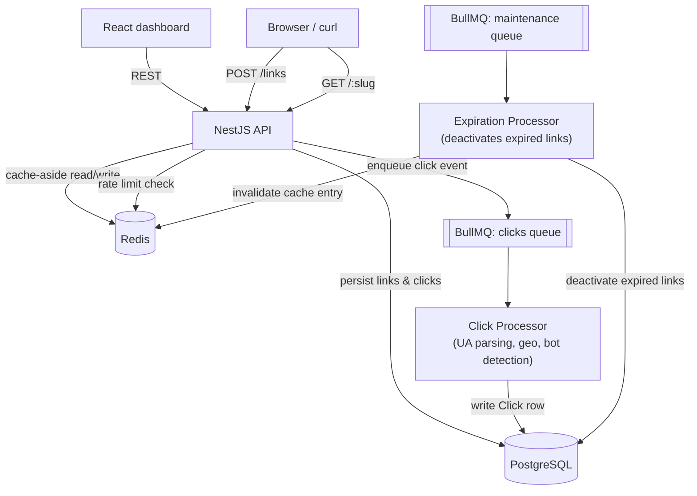

# LinkForge

A URL shortener with click analytics, built to demonstrate production-grade engineering practices: caching, rate limiting, async job processing, and a multi-layered automated test suite (94 tests across unit, integration, and end-to-end).

## What it does

- Shorten a URL, optionally with a custom alias and an expiration date
- Redirect through a Redis cache in front of Postgres, with sub-100ms responses on cache hits
- Track clicks asynchronously (browser, OS, country, bot detection) without slowing down the redirect itself
- Generate a QR code for any short link
- View click analytics and a live activity log in a small React dashboard

## Architecture



**Why it's built this way:**
- **Cache-aside on the redirect path** — the hottest endpoint in the system never waits on Postgres if Redis already has the answer. Cache TTL is capped at the link's own expiry, so nothing outlives its expiration date just because it's sitting in a cache.
- **Click recording is fully decoupled from the redirect response** — a redirect never waits on User-Agent parsing, geo lookup, or a database write. Those happen in a background worker via BullMQ, so a slow analytics write can never slow down a user's redirect.
- **Two independent rate limiters with two different threat models** — link creation is limited by IP (spam protection), while redirects are limited per-slug, not per-IP (protects one link from a traffic burst regardless of how distributed the sources are).

## Features

- Short link creation with optional custom alias and expiration date
- Race-condition-safe alias creation (concurrent requests for the same alias never both succeed)
- Redis-backed caching with automatic invalidation
- IP-based and per-link rate limiting with `Retry-After` headers
- Async click analytics: browser/OS parsing, offline IP geolocation, bot/crawler filtering
- Scheduled background job that deactivates expired links and cleans up their cache entries
- QR code generation (PNG/SVG) for any short link
- Prometheus-compatible `/metrics` endpoint
- React dashboard with paginated link list, analytics charts, and a virtualized click log

## Tech stack

| Layer | Choices |
|---|---|
| API | NestJS, TypeScript, Zod validation |
| Data | PostgreSQL + Prisma, Redis (cache, rate limiting, job broker) |
| Background jobs | BullMQ |
| Frontend | React 18, Vite, TanStack Query, TanStack Virtual, Recharts |
| Testing | Vitest (unit), Testcontainers (integration), Playwright (e2e), k6 (load) |
| Observability | pino (structured logs), prom-client (`/metrics`) |

## Getting started

```bash
# 1. Start Postgres + Redis
docker compose up -d

# 2. Backend
cd apps/api
pnpm install
cp .env.example .env
pnpm prisma:migrate
pnpm prisma:generate
pnpm start:dev

# 3. Frontend (separate terminal)
cd apps/web
pnpm install
pnpm dev
```

Backend runs on `http://localhost:3000`, dashboard on `http://localhost:5173`.

## Testing strategy

Tests are split into three layers, each answering a different question:

| Layer | Tool | Question it answers | Count |
|---|---|---|---|
| **Unit** | Vitest | Does our code handle every branch correctly, in isolation? | 78 |
| **Integration** | Vitest + Testcontainers | Do Postgres and Redis actually behave the way our unit tests assume? | 8 |
| **E2E** | Playwright | Does the whole system work together, against a live server? | 8 |

**Why integration tests exist separately from unit tests:** the unit tests for `LinksService` mock Prisma's unique-constraint error to verify our error-handling branch. That proves our code reacts correctly to that error — it doesn't prove Postgres actually raises it the way we assume. The integration suite runs the same race condition against a real, disposable Postgres container (via Testcontainers) and asserts on the real outcome. The same logic applies to the Redis cache: unit tests verify our TTL *calculation*, the integration test verifies Redis actually *expires the key* when told to.

**What's covered end-to-end:**
- Happy path: create → redirect → click appears in analytics
- Negative paths: 404 on missing/expired links, 409 on alias conflicts, a genuine concurrent race on link creation (not mocked), 429 with `Retry-After` on both rate limiters

**Load testing:** a k6 script (`load/k6-redirect.js`) measures redirect latency under load, separately for a warm-cache slug and a batch of guaranteed-cold-cache slugs, so cache impact is measurable rather than assumed.

```bash
cd apps/api
pnpm test              # unit
pnpm test:integration  # requires Docker
pnpm test:e2e          # requires a running instance
```

### Load test results

**Important:** `load/k6-redirect.js` hammers a single slug with up to 20 concurrent VUs, which blows through the default per-slug redirect rate limit (100 req/60s — see `rate-limit.module.ts`) in well under a second. That limit is tuned for abuse protection in production, not load-test throughput. For a clean latency benchmark, raise it for the run only:

```bash
RATE_LIMIT_REDIRECT_POINTS=1000000 pnpm start:dev
```

Then:

```bash
curl -X POST http://localhost:3000/links -H "Content-Type: application/json" \
  -d '{"originalUrl": "https://example.com", "customAlias": "k6-warm"}'
curl http://localhost:3000/k6-warm

cd .. && k6 run load/k6-redirect.js
```

The script now reports `warm_cache_429_ratio` explicitly and excludes 429 responses from the latency trend, so a run against the default (unmodified) rate limit is easy to spot rather than silently misleading — a high `warm_cache_429_ratio` means you're mostly measuring rejection speed, not cache speed.

**First run, against the default rate limit (before the fix above existed):**

| Scenario | VUs | p50 (med) | p95 | Requests |
|---|---|---|---|---|
| "Warm cache" — mostly rate-limited | 20 | 5.6ms | 10.3ms | ~10,630 in 30s |
| Cold cache (Postgres read) | 8 | 8.5ms | 10.8ms | 8 |

98.9% of the "warm cache" requests in that run were actually `429` rejections, not cache hits — the aggregate request rate (~354 req/s from 20 VUs) vastly exceeds the redirect limiter's ~1.67 req/s per slug, so the limit tripped almost immediately. The numbers above mostly describe how fast Redis can reject a request via the rate limiter, which is itself a reasonable (if unintended) data point, but not the cache-hit benchmark this table is meant to show.

**Clean run** (`RATE_LIMIT_REDIRECT_POINTS=1000000`, `warm_cache_429_ratio: 0.00%` — confirms every warm-cache request below was a genuine cache hit, not a rate-limit rejection):

| Scenario | VUs | p50 (med) | p90 | p95 | Requests |
|---|---|---|---|---|---|
| Warm cache (Redis hit) | 20 | 4.98ms | 9.56ms | 11.40ms | 10,628 in 30s (~303 req/s) |
| Cold cache (Postgres read, no cache entry) | 8 | 6.25ms | 17.24ms | 18.47ms | 8 |

p99 isn't in k6's default summary output — pass `--summary-trend-stats="p(50),p(95),p(99)"` on the `k6 run` command if you want it captured directly, or compute it from the raw output with `--out json=results.json`.

Even on a local machine (not a tuned production box), the warm-cache path is consistently faster than the cold-cache path at every percentile, and both stay well under 20ms — the cache-aside design is doing what it's meant to do.

## Project structure

```
apps/
  api/            # NestJS backend
    src/
      links/          # create, list, redirect lookups
      redirect/        # GET /:slug - cache-aside hot path
      cache/          # Redis cache-aside layer
      rate-limit/     # IP and slug-based rate limiting
      analytics/       # async click tracking, bot detection, aggregation
      jobs/           # scheduled expiration cleanup
      qr/              # QR code generation
      metrics/        # Prometheus /metrics endpoint
    test/integration/  # Testcontainers-based integration tests
    e2e/               # Playwright end-to-end tests
  web/            # React dashboard
    src/
      features/links/
      features/analytics/
      features/dashboard/
load/
  k6-redirect.js   # load test script
```
